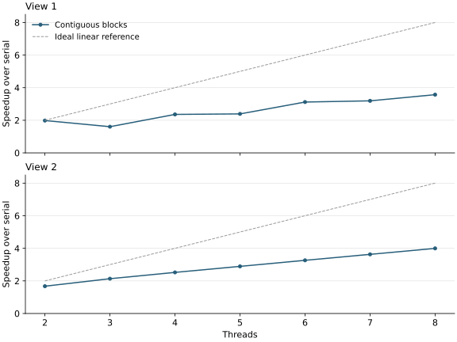

# P1 · Mandelbrot with threads

Render a 1600 × 1200 image with `std::thread`, using at most 256 iterations per pixel.


Views 1 and 2 from the handout. Brighter pixels require more computation.

## 1. Split the image between two threads

`workerThreadStart` in `mandelbrotThread.cpp`:

```cpp
void workerThreadStart(WorkerArgs * const args) {
    int startRow = 0;
    int numRows = args->height / 2;

    if (args->threadId == 1) {
        startRow = args->height / 2;
    }

    mandelbrotSerial(args->x0, args->y0, args->x1, args->y1,
                     args->width, args->height,
                     startRow, numRows,
                     args->maxIterations,
                     args->output);
}
```

### 1.1 How the row range controls the work { #how-the-row-range-controls-the-work }

`startRow` and `numRows` select the rows to render. Thread 0 handles `[0, 600)` and thread 1 handles `[600, 1200)`.

The complex-plane bounds (`x0`, `y0`, `x1`, `y1`) and full image dimensions stay unchanged, preserving the pixel coordinates in both workers.

Pixel `(r, c)` is stored at `output[r * width + c]`. The workers share the output array but write disjoint rows, so no lock is needed.

### 1.2 Where the second thread comes from { #where-the-second-thread-comes-from }

The starter's `mandelbrotThread` launches worker 1 with `std::thread`, runs worker 0 on the calling thread, and joins worker 1 before returning.

## 2. Extend to 2–8 threads

```cpp
void workerThreadStart(WorkerArgs * const args) {
    int numRows = args->height / args->numThreads;
    int startRow = args->threadId * numRows;

    if (args->threadId == args->numThreads - 1) {
        numRows = args->height - startRow;
    }

    mandelbrotSerial(args->x0, args->y0, args->x1, args->y1,
                     args->width, args->height,
                     startRow, numRows,
                     args->maxIterations,
                     args->output);
}
```

### 2.1 Block assignment

Let `q = height / numThreads`, using integer division. Worker `t` starts at `t * q` and initially receives `q` rows.

With seven threads, equal blocks cover only `7 × 171 = 1197` rows. The last worker starts at row 1026 and takes `1200 - 1026 = 174` rows, including the three-row remainder. This fixes the seven-thread mismatch.

### 2.2 Scaling results

The contiguous-block version gives the following speedups:



Scaling is not linear. For view 1, speedup falls from **1.98× with two threads to 1.61× with three**. Pixels require different numbers of iterations, so equally sized blocks can contain very different amounts of work. The middle block is the likely bottleneck.

## 3. Measure each worker

Add a timer around the block computation:

```cpp
void workerThreadStart(WorkerArgs * const args) {
    double startTime = CycleTimer::currentSeconds();

    int numRows = args->height / args->numThreads;
    int startRow = args->threadId * numRows;

    if (args->threadId == args->numThreads - 1) {
        numRows = args->height - startRow;
    }

    mandelbrotSerial(args->x0, args->y0, args->x1, args->y1,
                     args->width, args->height,
                     startRow, numRows,
                     args->maxIterations,
                     args->output);

    double endTime = CycleTimer::currentSeconds();
    printf("Thread %d: %.3f ms\n",
           args->threadId, (endTime-startTime)*1000);
}
```

For view 1 with three threads, median worker times over 15 invocations were:

| Worker | Time (ms) |
| ---: | ---: |
| 0 | 49.825 |
| 1 | 151.085 |
| 2 | 51.046 |

The middle block takes roughly three times as long as the outer blocks. Rendering must wait for this slowest worker, confirming that load imbalance causes the poor three-thread result.

## 4. Interleave the rows

```cpp
void workerThreadStart(WorkerArgs * const args) {
    double startTime = CycleTimer::currentSeconds();

    for (unsigned int i = args->threadId;
         i < args->height;
         i += args->numThreads) {
        mandelbrotSerial(args->x0, args->y0, args->x1, args->y1,
                         args->width, args->height,
                         i, 1,
                         args->maxIterations,
                         args->output);
    }

    double endTime = CycleTimer::currentSeconds();
    printf("Thread %d: %.3f ms\n",
           args->threadId, (endTime-startTime)*1000);
}
```

### 4.1 Row assignment

Worker `t` starts at row `t` and advances by `numThreads`. Each call with arguments `i, 1` renders one row:

```text
12 rows, 3 workers; entries are row numbers

              Contiguous blocks       Interleaved rows
              +-------------+         +-------------+
Worker 0      |  0  1  2  3 |         |  0  3  6  9 |
Worker 1      |  4  5  6  7 |         |  1  4  7 10 |
Worker 2      |  8  9 10 11 |         |  2  5  8 11 |
              +-------------+         +-------------+
```

Each row `r` belongs to worker `r % numThreads`, giving every row exactly one owner. The loop condition handles the bottom of the image even when the height is not divisible by the thread count.

Spreading rows throughout the image gives every worker a mixture of cheap and expensive pixels. In view 1, the costly middle region is shared across workers. This static mapping needs no communication during rendering and applies to both views.

### 4.2 Results

The three worker times for view 1 become **84.584, 88.906, and 88.950 ms**, much closer together.

Final eight-thread results:

| View | Serial (ms) | 8 threads (ms) | Speedup |
| --- | ---: | ---: | ---: |
| 1 | 241.408 | 41.502 | 5.82× |
| 2 | 135.515 | 24.461 | 5.54× |

Both views pass the pixel-by-pixel serial comparison.

### 4.3 Comparison with the handout { #comparison-with-the-handout }

The handout expects about 7–8× with eight threads.

The local i9-13900H combines six P cores and eight E cores, unlike the handout's four-core i7-7700K. Static row assignment gives each worker a similar amount of work, while completion time depends on the slowest worker's throughput. Core placement and clock behavior also affect the serial baseline.

A separate comparison tested default scheduling against restricting both serial and parallel runs to the eight E cores:

| View | CPU selection | Serial (ms) | 8 threads (ms) | Speedup |
| --- | --- | ---: | ---: | ---: |
| 1 | Default | 343.321 | 58.922 | 5.83× |
| 1 | Eight E cores | 530.944 | 66.802 | 7.95× |
| 2 | Default | 192.635 | 34.322 | 5.61× |
| 2 | Eight E cores | 316.804 | 40.039 | 7.91× |

The E-core results approach 8× partly because their serial baseline is slower. Default scheduling still gives shorter parallel runtimes.

## 5. Compare 8 and 16 threads

Using the improved, interleaved version:

| View | 8 threads (ms) | 16 threads (ms) | 16-thread speedup over serial | Gain over 8 threads |
| --- | ---: | ---: | ---: | ---: |
| 1 | 41.502 | 23.285 | 10.36× | 1.78× |
| 2 | 24.461 | 14.049 | 9.65× | 1.74× |

Sixteen threads improve performance on this machine. It has 14 physical cores and 20 logical CPUs, so additional threads can use more execution resources.

[Measurement method](measurements.md)
