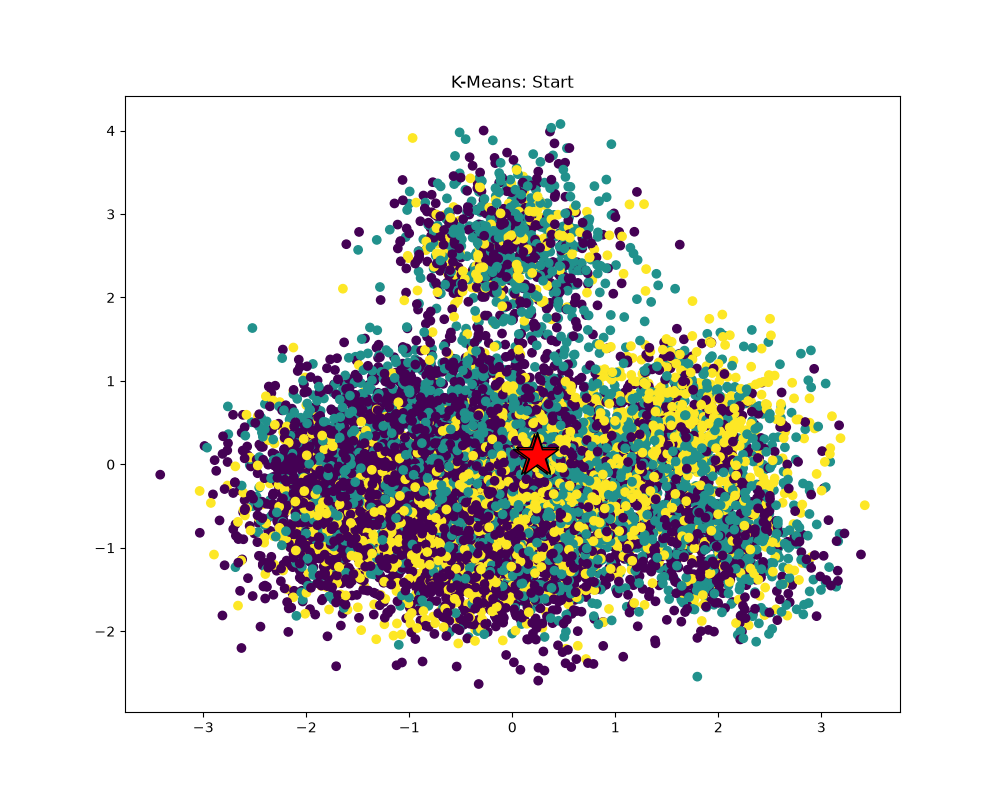
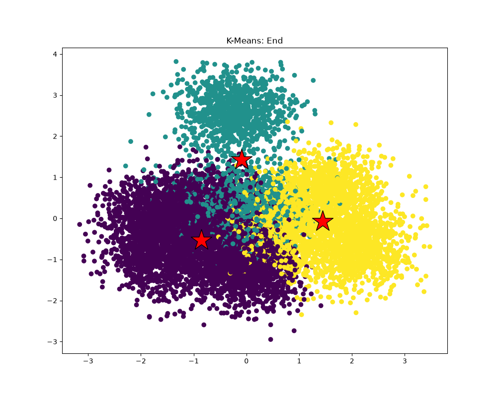

# P6 · Parallelizing K-means

## 1. Prepare the data and measure serial runtime

The starter generates **1,000,000 points, 100 dimensions, and 3 clusters**. The original serial implementation takes **5813.935 ms** (median of three runs).

## 2. Inspect the clustering

{ width="49%" }
{ width="49%" }

Local data projected to two dimensions by PCA. Colors show assignments; red stars mark centroids.

??? note "Handout example (2-D data)"

    

## 3. Locate the performance bottleneck

Phase times across 24 serial iterations:

| Phase | Time (ms) |
| --- | ---: |
| Assignment | 3751.303 |
| Centroid update | 921.564 |
| Cost | 1157.595 |

`computeAssignments` accounts for **64%** of the phase time. Here `M` is the number of points, `N` the dimensions per point, and `K` the number of clusters. Comparing every point with every centroid takes `O(M × K × N)` work per iteration.

Each point's assignment can be computed independently from the current centroids. With one million points and only three centroids, dividing the points gives many independent units of work and lets each worker finish a complete nearest-centroid search.

## 4. Parallelize the assignment phase

`workerThreadStart` in `kmeansThread.cpp`:

```cpp
void workerThreadStart(WorkerArgs * const args, double *minDist) {
    for (int m = args->threadId * args->M;
         m < (args->threadId+1) * args->M; m++) {
        for (int k = args->start; k < args->end; k++) {
            double d = dist(&args->data[m * args->N],
                            &args->clusterCentroids[k * args->N],
                            args->N);
            if (d < minDist[m]) {
                minDist[m] = d;
                args->clusterAssignments[m] = k;
            }
        }
    }
}
```

### 4.1 Follow one worker's assignment search { #follow-one-workers-assignment-search }

Each worker's `args->M` is its chunk size: **31,250 points** with 32 workers. Worker `t` processes point indices `[t * 31250, (t + 1) * 31250)`. The pointer still addresses the complete data array, so `m` is a global point index.

Each point occupies `N` consecutive doubles: `&data[m * N]` and `&clusterCentroids[k * N]` locate point `m` and centroid `k`. `dist` computes their Euclidean distance.

The inner loop scans all `K` centroids, retaining the shortest distance in `minDist[m]` and its centroid index in `clusterAssignments[m]`.

All workers read the same data and centroids, which stay fixed during assignment. Each worker writes only its own range of `minDist` and `clusterAssignments`, so these writes need no locks. Equal-sized chunks require the point count to be divisible by 32.

### 4.2 Start the workers and wait for completion { #start-the-workers-and-wait-for-completion }

```cpp
void computeAssignments(WorkerArgs *const workerArgs) {
    static constexpr int MAX_THREADS = 32;
    double *minDist = new double[workerArgs->M];

    for (int m=0; m<workerArgs->M; m++) {
        minDist[m] = 1e30;
        workerArgs->clusterAssignments[m] = -1;
    }

    std::thread workers[MAX_THREADS];
    WorkerArgs args[MAX_THREADS];

    for (int i=0; i<MAX_THREADS; i++) {
        args[i].data = workerArgs->data;
        args[i].clusterCentroids = workerArgs->clusterCentroids;
        args[i].clusterAssignments = workerArgs->clusterAssignments;
        args[i].M = workerArgs->M / MAX_THREADS;
        args[i].K = workerArgs->K;
        args[i].N = workerArgs->N;
        args[i].start = workerArgs->start;
        args[i].end = workerArgs->end;
        args[i].threadId = i;
    }

    for (int i=1; i<MAX_THREADS; i++) {
        workers[i] = std::thread(workerThreadStart, &args[i], minDist);
    }

    workerThreadStart(&args[0], minDist);

    for (int i=1; i<MAX_THREADS; i++) {
        workers[i].join();
    }

    delete[] minDist;
}
```

`workerArgs->M` is the total point count; `args[i].M` is the per-worker chunk size. Distances and assignments are reset each iteration because the centroids have moved.

The caller launches workers 1–31, then runs worker 0. All workers must finish before `minDist` is freed and the centroid update reads their assignments:

```text
Initialize minDist and assignments
                  |
     +------------+-------------+
     v            v             v
 worker 0     worker 1  ...  worker 31
 own points   own points     own points
     |            |             |
     +------------+-------------+
                  | all workers finish
                  v
          Update centroids
                  |
             Compute cost
                  |
          Test convergence
            /          \
          Done      Next iteration
```

The measured speedup includes the change from centroid-first to point-first loop order as well as threading.

### 4.3 Verify and measure { #verify-and-measure }

| Version | Median time (3 runs) |
| --- | ---: |
| Original serial | 5813.935 ms |
| Parallel version | 2544.944 ms |

Overall speedup is **2.28×**. Final assignments and centroids match the serial result exactly.

Assignment time drops from **3751.303 ms to 406.651 ms (9.22×)**. Centroid update and cost calculation remain serial and take about two seconds, limiting the overall speedup.

[Complete-run measurements](../assets/benchmarks/p6-results.json)
